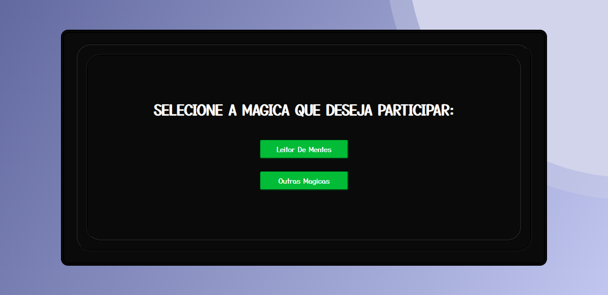
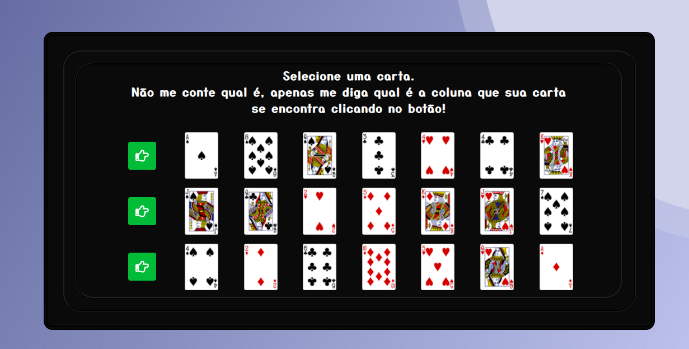
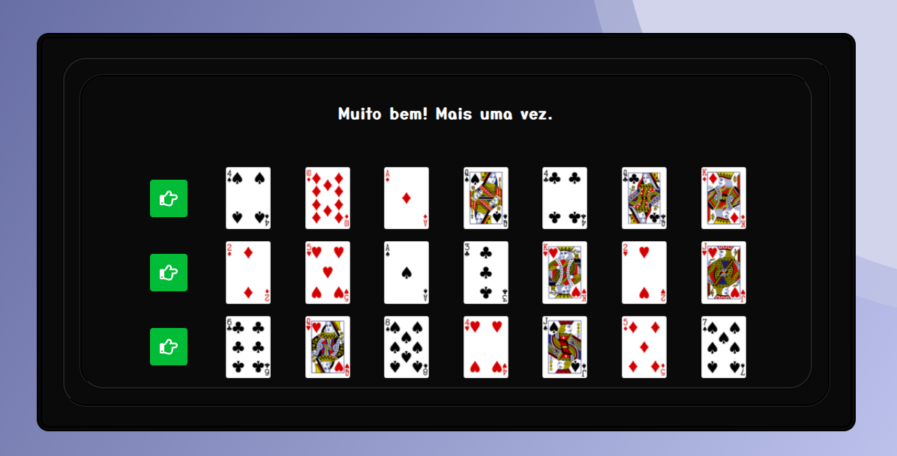
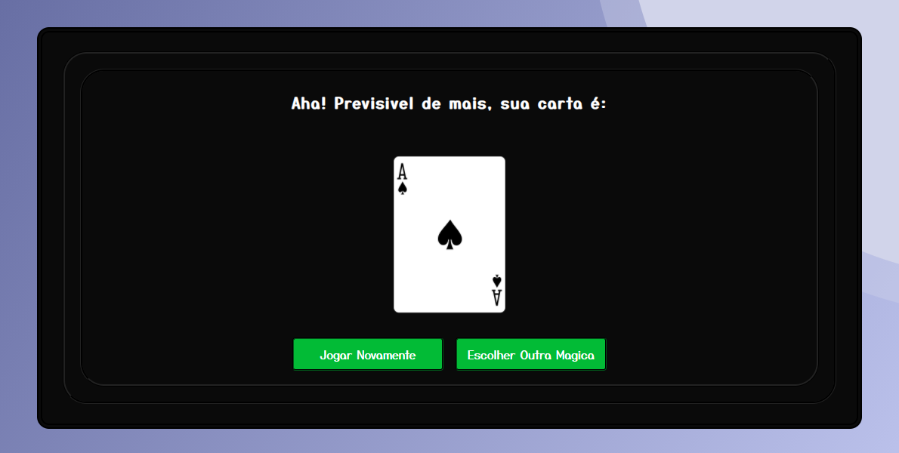

<p align="center">
  <a href="https://magictricksgame.herokuapp.com/">
    
  </a>
</p>

<h4 align="center">

[Descrição](#desc) ✦ [Tecnologias](#tec) ✦ [Projeto](#Projeto) ✦ [Rodando localmente](#local) ✦ [Licença](#lic)

<br>

</h4>

<br>

<h2 id="desc">
💟 Sobre o projeto
</h2>

<p align="justify">
O <b>Magic Tricks Game</b> é uma aplicação web com o intuito de divertir quem utiliza. A aplicação basicamente lê sua mente ao advinhar a carta que vocês escolheu!
<br/>

<h2 id="tec">
🛸 Tecnologias
</h2>

<a href="https://reactjs.org">
 
</a>

<br>

<h2 id="Projeto">
👔 Projeto
</h2>

<a href="https://magictricksgame.herokuapp.com/">

</a>
<h6 align="center">Clique na imagem para visualizar a aplicação</h6>

<br>

<h2>🖥 Capturas de tela</h2>

<table>
  <tr align="center">
    <td><h5>Escolhendo a carta</h5></td>
    <td><h5>Selecionando linha</h5></td>
    <td><h5>Descobrindo a carta</h5></td>
  </tr>
  <tr>
    <td></td>
    <td></td>
    <td></td>
  </tr>
  <tr>
</table>

<br>

<br>

<h2 id="local">
⚛ Rodando aplicação localmente
</h2>

> **⚠ Atenção !** <br> Antes de prosseguir com o passo a passo abaixo você precisa ter instalado em sua máquina o gerenciador de pacote [Yarn](https://classic.yarnpkg.com/en/docs/install) e o [Git](https://git-scm.com).

<br>

> 📝 Clonando o repositório e entrando no diretório criado.

```shell
git clone https://github.com/SaMatheus/grupogps-frontend-test.git && cd grupogps-frontend-test
```

> 📝 Baixando / Instalando dependências.

```shell
yarn install
```

> 📝 Rodando Aplicação

```shell
yarn dev
```

> Pronto 🎉 se tudo ocorreu conforme o esperado 😁 a aplicação estará
> rodando na porta 3000. Basta acessar o endereço no navegador
> http://localhost:3000 e você verá a aplicação funcionando.

<br>

<h2 id="lic">
📃 Licença
</h2>

Este projeto esta sobe a licença [MIT](./LICENSE).

created by [Matheus Sá](https://github.com/SaMatheus)
